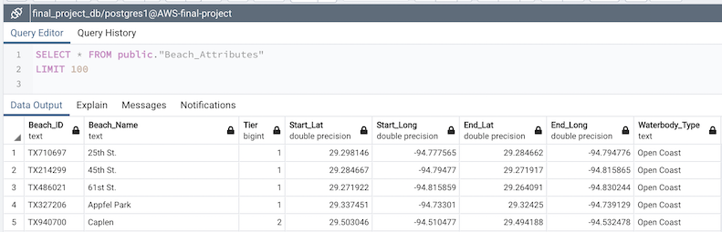
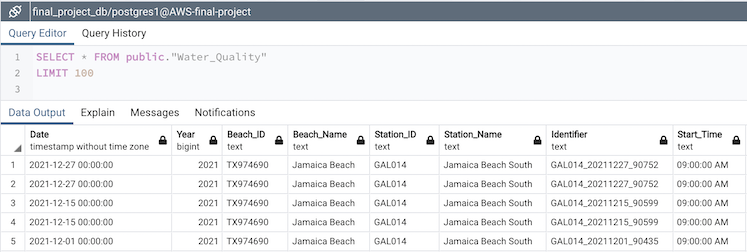
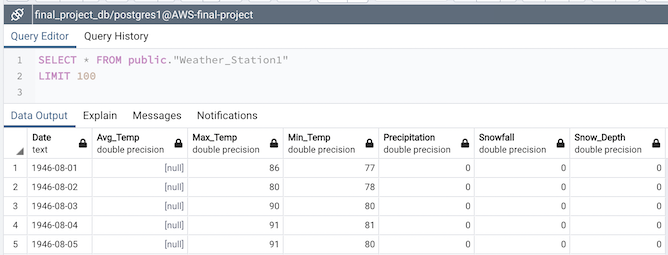
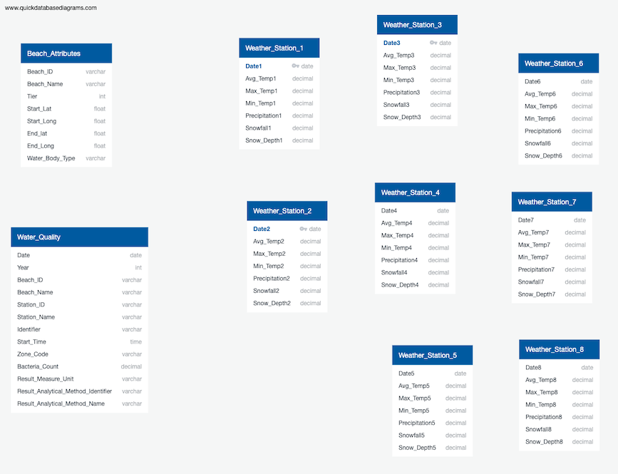

# Database Work Log

## Segment 1 - Bianca Taise Pommerening

Our data consists of twelve datasets in CSV format files; two of them hold beach attributes and water quality while the other ten represent weather stations in Galveston county.

## Database Mockup Design:

- Three out of the twelve datasets were used;
- Google Drive is temporarily storing the datasets;
- Pandas library was used for some basic ETL;
- SQLalchemy was used to create the engine to connect and load the dataframes to a PostgreSQL database;
- AWS RDS instance was used as our Relational Database Solution;
- PgAdming was used to manage the tables in the database.

## Loading Test

Below we can see the three tables loaded on pgAdmin without problems:

### **Beach Attributes**

- Names of the columns were standardized for easier readability and compatibility.

### **Water Quality**

- Names of the columns were standardized for easier readability and compatibility.

### **Weather Station 1**

- Names of the columns were standardized for easier readability and compatibility.
- It was decided not to drop any columns of the Weather_Station1 table because prior to that we need to further investigate the other weather_station files to see if we will combine them in any way.

## Entity Relationship Diagram - ERD

- The Entity Relationship Diagram is at its very first stage where the tables have not been connected because we don't have unique keys yet.

## Second Segment Suggestions

- Dataframes:
	- Clean and investigate Datasets further.
	- Decide which columns to drop and whether we are combining these datasets in any other way.

- ERD and Database Schema
	- Try to find a combination of features that make a combined unique key after further cleaning and investigating the datasets.

## Create View and Join Tables

- Use a right join to join water_quality to beach_attributes on beach_attributes.beach_id = water_quality.beach_id.
- Use a left join to join weather_station1, weather_Station18, and weather_station 54  to water_quality on water_quality.data = weather_station(number).date(number). Number equates the station number. 
- Added a WHERE clause to exclude beaches that were not on Galveston island. The beach_attributes data frame included beaches throughout Galveston county which was much larger area the the analysis area. We utilized the WHERE clause to exclude latitudes and longitunes that expanded further than Galvestion Island. 
- Created a View galveston_data_join and selected the column we wanted to call form each table. The view was crated to give all teammates access to the joined tables. 

