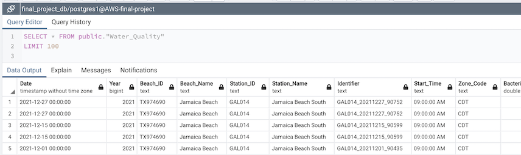

# Beach Bacteria Prediction Modeling Project

## Problem

Texas beaches are a great place to relax and have fun, but there are potential dangers in the water. Bacteria levels can exceed safe levels causing the state to close beaches (loss of revenue for locals) or at worst make bathers sick. 

The state currently tests and reports bacteria levels for several beaches and displays bacteria counts at [TexasBeachWatch.com](https://cgis.glo.texas.gov/Beachwatch/#).

The problem is that testing occurs weekly or bi weekly, there is a delay time of at least three if not more days from when the sample is taken and finally reported to the public. By the time results come back, bacteria levels may have risen to unsafe levels.

## Proposal

Using historical bacteria sample and weather records, we propose to train a regression model that estimates the bacteria counts when provided weather information. If successful, the delay from testing to reporting to the public would be greatly reduced.

## Data Sources

- Beach Advisory and Closing On-line Notification historical bacteria levels [example](https://beacon.epa.gov/ords/beacon2/f?p=121:38:16858900653526::::). (CSV download)

- Historical Weather Data [example](https://www.ncei.noaa.gov/access/past-weather/Galveston%2C%20Texas). (CSV download)

## Appendix

- [Texas Beaches May Be Filthier Than We Realize - Texas Monthly](https://www.texasmonthly.com/news-politics/texas-beaches-filthy-feces-testing/)

# Team Communications Protocals

## Zoom Meeting
The team will meet weekly via zoom at 9:00 AM on Monday to map out a work plan and duties for the coming week.

## Slack
Primary channel for real time coummunications between team members and instructional staff.

## Github
Comment on pull request and issues to create a record of work specific to changes in the repo.

# Deliverables Update

## Database

Our data consists of twelve datasets in CSV format files; which two of them hold beach attributes and water quality while the other ten represent weather stations on Galveston Island.

### Database Mockup Design:

- Three out of the twelve datasets were used;
- Google Drive is temporarily storing the datasets;
- Pandas library was used for some basic ETL;
- SQLalchemy was used to create the engine to connect and load the dataframes to a PostgreSQL database;
- AWS RDS instance was used as our Relational Database Solution;
- PgAdming was used to manage the tables in the database.

### Loading Test

Below we can see the three tables loaded on pgAdmin without problems:

#### **Beach Attributes**

- Names of the columns were standardized for easier readability and compatibility.

#### **Water Quality**

- Names of the columns were standardized for easier readability and compatibility.

#### **Weather Station 1**

- Names of the columns were standardized for easier readability and compatibility.
- It was decided not to drop any columns of the Weather_Station1 table because prior to that we need to further investigate the other weather_station files to see if we will combine them in any way.

### Entity Relationship Diagram - ERD

- The Entity Relationship Diagram is at its very first stage where the tables have not been connected because we don't have unique keys yet.

### Future Work / Suggestions

- Dataframes:
	- Clean and investigate Datasets further.
	- Decide which columns to drop and whether we are combining these datasets in any other way.

- ERD and Database Schema
	- Try to find a combination of features that make a combined unique key after further cleaning and investigating the datasets.